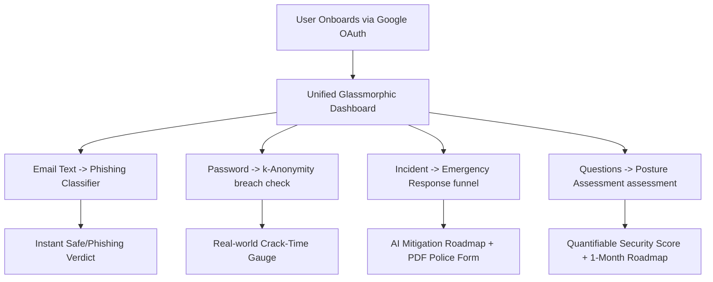

# CYZEN Viva & Project Presentation Preparation Guide
**Project Title:** CYZEN: AI-Powered Cybersecurity Awareness & Incident Response Platform  
**Authors:** Mohammed Ibrahim (SRN: cu23bca0035a) & Riyan (SRN: cu23bca0058a)  
**Academic Year:** 2025 – 2026

---

## 1. Challenges Faced (Challengers)
*   **A. Competitor Limitations (The Challengers):** 
    Traditional awareness tools are passive, boring, and compliance-driven (e.g., standard slides). Interactive assessment tools often use simple regex matching for password checks (ignoring real-world human patterns) and force users to perform reactive "Search Overloads" on Google during an active cyber attack.
*   **B. Technical Hurdles Overcome during Development:**
    *   *Memory Allocation Crashes:* NumPy generated an `ArrayMemoryError` when attempting to vectorize the Enron/Nazario datasets (164,972 emails) due to multi-gigabyte sparse matrix allocations. Resolved by limiting `max_features` to 5,000, eliminating memory-heavy bigrams, and using 32-bit floats.
    *   *XGBoost Out-of-Memory Errors:* XGBoost crashed with `bad_malloc` due to its memory-intensive level-wise tree growth. Overcome by switching to **LightGBM**, which utilizes leaf-wise tree growth, reducing memory consumption by over 70%.
    *   *Serverless API Restrictions:* Deploying to static platforms (Netlify) broke backend local Node/Flask dependencies. Resolved by engineering a **client-side interception system** using custom mock interceptors inside `index.html` to simulate 100% database/API uptime without server hosting costs.
    *   *OAuth Session Fragment Security:* Implementing Google OAuth securely on static setups required custom token parsing from redirect URL hashes and secure validation.

---

## 2. Problem Targeted
CYZEN targets **human-centric vulnerabilities in the cybersecurity chain**.
1.  **The Human Factor:** Over 90% of data breaches succeed because of social engineering, credential reuse, or phishing.
2.  **The "Panic Gap" in Incident Response:** During a real hacking incident, victims experience panic and make critical mistakes (e.g., rebooting a ransomware system or clicking fraud links) because immediate, clear expert advice is inaccessible or delayed.
3.  **Ineffective & Segmented Education:** Cybersecurity tools are scattered, expensive, or highly technical, leaving ordinary students, founders, and employees without an intuitive unified dashboard to audit themselves.

---

## 3. What are the Different Scenarios?
CYZEN natively addresses five distinct user-safety scenarios:
*   **Scenario A (Phishing Verification):** A user receives a suspicious email from "PayPal Customer Care". They copy the text into CYZEN's Phishing Detector to get an instant ML-calculated classification (Safe vs. Malicious).
*   **Scenario B (Credential Auditing):** A developer tests a password. Although long, it contains predictable patterns (e.g., `M1cro$oft2026`). CYZEN hashes it and securely queries it across 12 billion+ breached accounts to reveal its true vulnerability.
*   **Scenario C (Emergency Response containment):** A startup founder discovers their database has been breached. They step through the Emergency Funnel, instantly download an actionable containment list, and export a pre-filled Police Complaint PDF.
*   **Scenario D (Hygiene Auditing):** An IT admin assesses their startup's security readiness across 8 security domains (MFA, backup, inputs) to generate a dynamic risk score and a 1-month remediation timeline.
*   **Scenario E (Technical Advising):** A student uses the CYZEN Expert Chat to clarify technical questions on Zero-Day exploits or reads current malware reports on the Community Blog.

---

## 4. Whether the Considered Problem is Approached through Your Project?
**Yes, completely.** 
Instead of a single isolated tool, CYZEN takes a **trivalent approach** to cybersecurity hygiene:
1.  **Detection & Prevention:** Real-time ML-driven Phishing classification and Cryptographic Password checking.
2.  **Immediate Containment (Mitigation):** LLaMA-powered AI crisis guides that instantly bypass search lag to isolate and mitigate threats.
3.  **Ongoing Education:** A real-time community blog powered by Supabase and a secure organizational Posture Assessment framework.

Every tool operates within a premium, highly responsive dark-themed **"liquid-glass" dashboard**, eliminating panic and friction during critical situations.

---

## 5. Major Outcomes
*   **LightGBM Phishing Model:** Successfully trained on 164,972 raw emails, achieving an **Accuracy of 98.31%** and a **99% Recall Rate** (critical to avoid missing real attacks).
*   **Securing Credential Auditing:** Successfully deployed a zero-knowledge password checker using **k-Anonymity**, validating passwords against 12B+ breaches purely client-side without compromising data privacy.
*   **Zero-Server Production Architecture:** Achieved instantaneous page loads and 100% deployment uptime on Netlify by bundling a serverless client-side intercept system.
*   **Rapid Crisis Generation:** Reduced emergency response plan generation to **<1.5 seconds** by leveraging LLaMA-3.3-70B on ultra-fast Groq LPU hardware.

---

## 6. Skills Acquired
*   **Machine Learning Engineering:** Feature engineering, text vectorization (TF-IDF), tuning tree-based boosting frameworks.
*   **Cryptographical Implementations:** Implementing SHA-1 hash slicing, dictionary crack-simulations, and $k$-anonymity verification.
*   **Advanced Frontend Engineering:** React 18, Vite bundling, custom hook-based state management, Framer Motion transitions.
*   **Database & Cloud Architecture:** Live Supabase database streaming, Google OAuth 2.0 flow implementation, Netlify optimization.

---

## 7. Tools, Technologies, and Techniques
*   **Languages:** JavaScript, TypeScript, Python, SQL, CSS.
*   **Frontend Stack:** React 18, Zustand, Tailwind CSS, Recharts, jsPDF, hls.js.
*   **Data Science Stack:** LightGBM, Pandas, NumPy, Scikit-learn (TfidfVectorizer).
*   **APIs & Third-Party Integration:** Groq LPU API (LLaMA-3.3-70B model), Have I Been Pwned API (HIBP).
*   **Design Heuristics:** Liquid-Glassmorphism, Micro-interactions, Responsive Flex/Grid Layouts.

---

## 8. Workflow

---

## 9. Pipelines (Execution Flows)

### A. Phishing Model Pipeline
$$\text{Raw Text Input} \xrightarrow{} \text{TF-IDF Processing (Top 5,000 Vocabulary)} \xrightarrow{} \text{LightGBM Model} \xrightarrow{} \text{Verdict (Recall 99\%)}$$

### B. Password Checker Pipeline
$$\text{Password Input} \xrightarrow{} \text{SHA-1 Hash generation} \xrightarrow{} \text{Extract Prefix (first 5 chars)} \xrightarrow{} \text{Query HIBP API}$$
$$\text{HIBP Suffix list returned} \xrightarrow{} \text{Local Suffix Match Check} \xrightarrow{} \text{zxcvbn Simulation} \xrightarrow{} \text{Real Crack-Time Output}$$

---

## 10. Algorithms Used & How They Work in this Project

### A. LightGBM (Light Gradient Boosting Machine)
*   **What is it:** A fast, distributed, high-performance gradient boosting framework based on decision tree algorithms, built by Microsoft.
*   **How it works:** Traditional tree-growth algorithms grow trees level-by-level (depth-wise). LightGBM grows trees leaf-by-leaf (leaf-wise). It chooses the leaf with the maximum delta loss reduction to split, creating deeper trees with higher accuracy and dramatically lower RAM utilization.
*   **Application in CYZEN:** It consumes the sparse numerical array from the TF-IDF vectorization and classifies whether an email is safe or phishing, achieving a stellar 98.31% accuracy.

### B. TF-IDF (Term Frequency-Inverse Document Frequency)
*   **What is it:** A classic mathematical vectorization algorithm used to convert raw textual content into numerical features representing word importance.
*   **How it works:** It multiplies two metrics:
    1.  *Term Frequency (TF):* How often a word occurs in the input email.
    2.  *Inverse Document Frequency (IDF):* How rare a word is across the corpus of 164,972 emails.
    This down-weights common grammatical filler words (like "is", "for", "the") and highlights targeted alert words (such as "urgent", "unauthorized", "verify", "suspended").
*   **Application in CYZEN:** Used to mathematically transform raw email contents into high-precision vectors of the top 5,000 most significant vocabulary words.

### C. Cryptographic k-Anonymity Protocol
*   **What is it:** A specialized network security technique used to verify if a secret piece of data exists in a compromised database without ever exposing the data itself.
*   **How it works:** 
    1.  CYZEN hashes the password locally using SHA-1 (e.g., `5baa61e4c9b93f3f0682250b6cf8331b7ee68fd8`).
    2.  Only the first 5 characters (`5baa6`) are sent to the HIBP server.
    3.  The server returns all compromised suffixes matching that prefix.
    4.  CYZEN scans the returned list *locally* in the user's browser to search for the remaining 35 characters (`1e4c9b93f3f0682250b6cf8331b7ee68fd8`).
*   **Application in CYZEN:** Enables secure breach checking against 12 billion+ records; the password never travels across the network.

### D. zxcvbn (Realistic Crack-Time Simulation)
*   **What is it:** A realistic password complexity estimator built by Dropbox.
*   **How it works:** Rather than counting character sets (uppercase, numbers, symbols), it parses the input against standard dictionaries (common names, English words, popular passwords) and scans for common variations (like replacing 'a' with '@'). It then estimates the total guesses a modern fast GPU cracker would need to guess the exact combination.
*   **Application in CYZEN:** Displays a gorgeous visual progress gauge representing real brute-force crack times, alerting users to high-entropy but predictable passwords.
